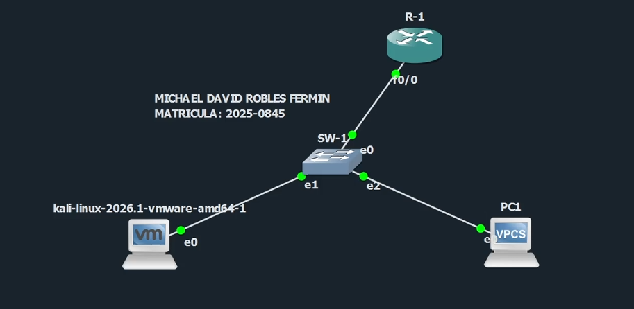
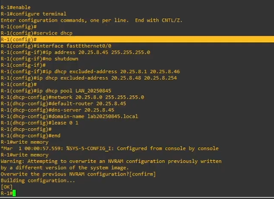
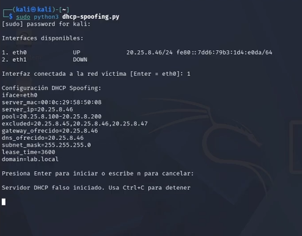
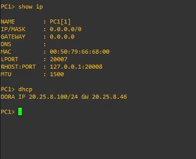
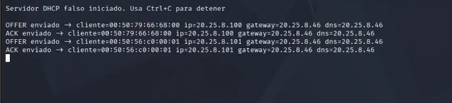
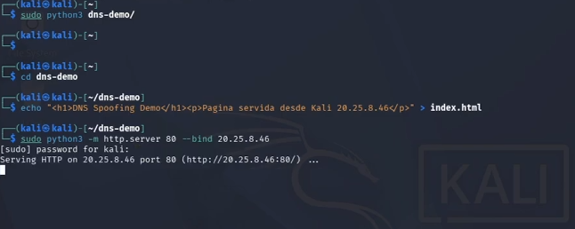
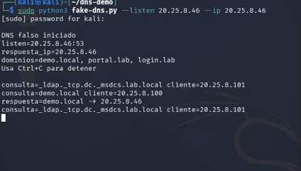
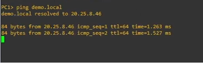
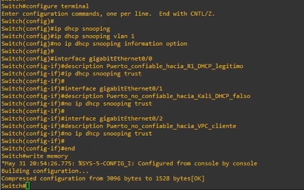
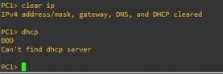

# Ataque DHCP Spoofing


## Información del proyecto

Este repositorio documenta y demuestra un ataque **DHCP Spoofing** dentro de un laboratorio controlado de Seguridad de Redes. El ataque consiste en levantar un servidor DHCP no autorizado desde Kali Linux para entregar a la víctima una configuración de red manipulada, incluyendo gateway y DNS apuntando hacia el atacante.

**Autor:** Michael David Robles Fermín / iClexi  
**Matrícula:** 2025-0845  
**Repositorio:** https://github.com/iClexi/DHCP-Spoofing-Attack  
**Video demostrativo:** https://www.youtube.com/watch?v=8mBYpaTNwKk

## Documentación técnica profesional

Para una explicación más detallada del ataque, la topología, el funcionamiento del script, las evidencias y las contramedidas aplicadas, consultar el documento técnico profesional:

[Ver documentación técnica profesional](docs/documentacion-tecnica-profesional.pdf)

Ruta directa del archivo: `docs/documentacion-tecnica-profesional.pdf`

## Aviso de uso responsable

Este proyecto fue desarrollado únicamente con fines educativos, académicos y de laboratorio controlado. Los scripts y comandos deben ejecutarse solamente en entornos propios o autorizados, como GNS3, EVE-NG, PNETLab o laboratorios internos de práctica.

No debe utilizarse en redes públicas, empresariales o de terceros sin autorización explícita.

## Objetivo del laboratorio

Demostrar cómo un atacante conectado a la misma red local puede ejecutar un servidor DHCP falso para entregar parámetros de red maliciosos a una víctima. El laboratorio evidencia cómo la víctima puede aceptar como gateway y DNS al equipo atacante, permitiendo manipulación de tráfico y resolución de dominios hacia servicios falsos.

## Objetivo del script

El script `dhcp-spoofing.py` permite iniciar un servidor DHCP falso desde Kali Linux. Su objetivo es responder solicitudes DHCP de clientes dentro de la red y entregar una configuración controlada por el atacante.

En esta práctica, Kali entrega:

```text
Servidor DHCP falso: 20.25.8.46
Gateway falso:       20.25.8.46
DNS falso:           20.25.8.46
Pool malicioso:      20.25.8.100 - 20.25.8.200
```

## Archivos del repositorio

| Archivo | Descripción |
|---|---|
| `dhcp-spoofing.py` | Script principal para ejecutar el servidor DHCP malicioso. |
| `fake-dns.py` | Script usado para responder consultas DNS de dominios permitidos hacia la IP de Kali. |
| `README.md` | Guía principal tipo how-to del laboratorio. |
| `images/` | Capturas utilizadas como evidencia del ataque y su mitigación. |
| `docs/` | Documentación técnica profesional en PDF y DOCX. |

## Topología utilizada

La topología del laboratorio está compuesta por un router R-1, un switch SW-1, una máquina Kali Linux atacante y una víctima PC1/VPCS.



| Dispositivo | Interfaz | Dirección IP | Rol |
|---|---|---|---|
| R-1 | FastEthernet0/0 | `20.25.8.45/24` | Gateway y DHCP legítimo |
| SW-1 | Gi0/0 | N/A | Conexión hacia R-1 |
| SW-1 | Gi0/1 | N/A | Conexión hacia Kali |
| SW-1 | Gi0/2 | N/A | Conexión hacia PC1 |
| Kali Linux | eth0 | `20.25.8.46/24` | Atacante, DHCP/DNS/Web falso |
| PC1/VPCS | e0 | DHCP | Víctima |

## Requisitos previos

- Laboratorio en GNS3 o entorno equivalente.
- Router Cisco con servicio DHCP habilitado.
- Switch Cisco IOSvL2.
- Kali Linux con Python 3.
- Permisos de superusuario en Kali.
- Víctima VPCS o Linux en la misma red local.
- Conectividad de capa 2 entre Kali, PC1 y R-1.

## 1. Configuración básica de DHCP legítimo

Antes del ataque, R-1 funciona como servidor DHCP legítimo. Esta configuración permite que los clientes obtengan una IP, gateway y DNS válidos desde el router.

```cisco
enable
configure terminal
service dhcp

interface fastEthernet0/0
ip address 20.25.8.45 255.255.255.0
no shutdown

ip dhcp excluded-address 20.25.8.1 20.25.8.46
ip dhcp excluded-address 20.25.8.48 20.25.8.254

ip dhcp pool LAN_20250845
network 20.25.8.0 255.255.255.0
default-router 20.25.8.45
dns-server 20.25.8.45
domain-name lab20250845.local
lease 0 1

end
write memory
```



## 2. Ejecución del servidor DHCP falso

Desde Kali Linux se ejecuta el script `dhcp-spoofing.py`. El script inicia un servidor DHCP malicioso que responde a solicitudes de clientes dentro de la red.

```bash
sudo python3 dhcp-spoofing.py
```

Durante la ejecución, el script muestra la interfaz seleccionada, la IP del servidor falso, el gateway, el DNS y el rango de direcciones que entregará a la víctima.



## 3. DHCP exitoso en PC1 con servidor malicioso

Después de limpiar la IP de PC1 y solicitar DHCP nuevamente, la víctima acepta la configuración entregada por Kali. En la evidencia se observa que PC1 recibe la IP `20.25.8.100/24` y usa como gateway `20.25.8.46`, que corresponde al atacante.

```text
PC1> clear ip
PC1> dhcp
PC1> show ip
```



## 4. Proceso DORA desde el servidor malicioso

El script muestra el proceso DHCP completo: `OFFER` y `ACK` enviados hacia los clientes. Esto confirma que el servidor DHCP falso está completando correctamente el intercambio DORA.



## 5. Creación y ejecución de página falsa

Como la víctima recibió el DNS falso desde Kali, el atacante puede controlar la resolución de dominios internos. Para demostrarlo, se crea una página web falsa y se levanta un servidor HTTP en Kali.

```bash
mkdir -p dns-demo
cd dns-demo
echo "<h1>DNS Spoofing Demo</h1><p>Pagina servida desde Kali 20.25.8.46</p>" > index.html
sudo python3 -m http.server 80 --bind 20.25.8.46
```



## 6. Listener DNS falso

Luego se ejecuta el servidor DNS falso para responder consultas de dominios permitidos como `demo.local`, `portal.lab` y `login.lab`, apuntándolos hacia la IP del atacante.

```bash
sudo python3 fake-dns.py --listen 20.25.8.46 --ip 20.25.8.46
```



## 7. Prueba de dominio falso demo.local

Desde PC1 se realiza un ping hacia `demo.local`. Como la víctima recibió como DNS a Kali, el dominio se resuelve hacia `20.25.8.46`.

```text
PC1> ping demo.local
```



## 8. Mitigación con DHCP Snooping

La contramedida aplicada es **DHCP Snooping**. Esta defensa permite que el switch bloquee respuestas DHCP provenientes de puertos no confiables. En este laboratorio, el puerto hacia R-1 se marca como confiable y los puertos hacia Kali y PC1 permanecen como no confiables.

```cisco
enable
configure terminal

ip dhcp snooping
ip dhcp snooping vlan 1
no ip dhcp snooping information option

interface gigabitEthernet0/0
description Puerto_confiable_hacia_R1_DHCP_legitimo
ip dhcp snooping trust

interface gigabitEthernet0/1
description Puerto_no_confiable_hacia_Kali_DHCP_falso
no ip dhcp snooping trust

interface gigabitEthernet0/2
description Puerto_no_confiable_hacia_VPC_cliente
no ip dhcp snooping trust

end
write memory
```



## 9. Verificación después de la mitigación

Después de aplicar DHCP Snooping, se limpia la configuración IP de PC1 y se solicita DHCP nuevamente. La víctima ya no recibe configuración desde el servidor falso, lo que evidencia que el switch bloqueó las respuestas DHCP maliciosas provenientes del puerto no confiable.

```text
PC1> clear ip
PC1> dhcp
```



## Video demostrativo

La demostración práctica del ataque y su mitigación está disponible en YouTube:

[Ver video del laboratorio en YouTube](https://www.youtube.com/watch?v=8mBYpaTNwKk)

URL directa: https://www.youtube.com/watch?v=8mBYpaTNwKk

## Conclusión

Este laboratorio demuestra cómo un servidor DHCP no autorizado puede manipular la configuración de red de una víctima, entregando gateway y DNS controlados por el atacante. A partir de ese control, el atacante puede redirigir tráfico, manipular resolución de nombres y presentar servicios falsos dentro del laboratorio.

La mitigación más adecuada en switches Cisco es **DHCP Snooping**, configurando como confiable únicamente el puerto hacia el servidor DHCP legítimo y dejando como no confiables los puertos de usuario. De esta forma, el switch bloquea respuestas DHCP provenientes de Kali y evita que la víctima acepte configuraciones maliciosas.

## Autor

Este laboratorio fue realizado y documentado por:

**Michael David Robles Fermín / iClexi**  
Matrícula: **2025-0845**

## Aviso final

Este repositorio y sus scripts deben utilizarse únicamente en laboratorios controlados y autorizados. No se autoriza su uso en redes públicas, empresariales o de terceros sin permiso explícito.
